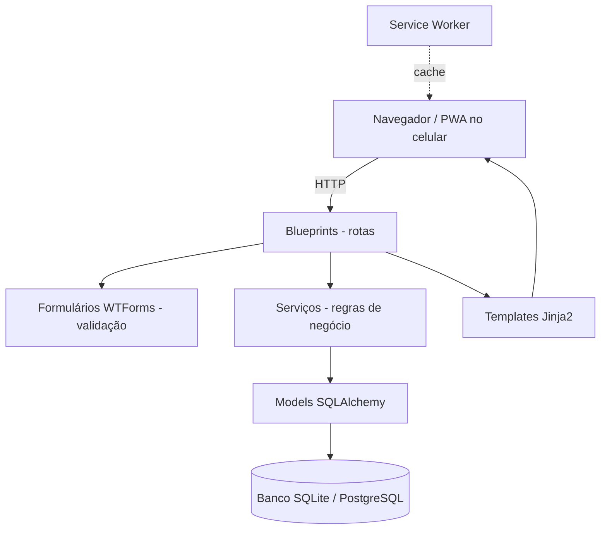
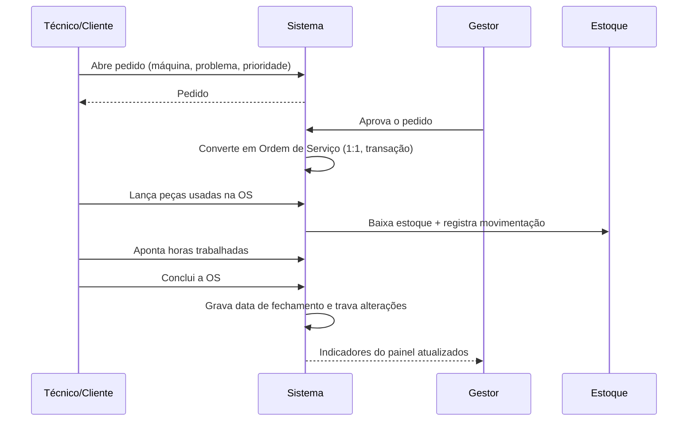

# Arquitetura do TechMaint

## Decisão central

Aplicação **web em Flask**, renderizada no servidor (Jinja2), servida como **PWA** para
instalar no iPhone e no Android. **100% Python**, sem Node, sem npm, sem framework de
JavaScript.

### Por que Flask e não Streamlit

O cardápio da disciplina oferece Streamlit, Flask, FastAPI, Tkinter e PySide6. O Streamlit
seria mais rápido de começar, mas:

- não dá controle sobre o HTML — sem controle do HTML **não existe PWA**, que é o nosso diferencial;
- não tem sessão de login por perfil de forma natural;
- não permite o layout do Figma.

FastAPI seria excelente para uma API, mas exigiria um front separado — o que quebraria a regra
de ser 100% Python. **Flask** entrega rotas, templates, formulários, login e controle total do
HTML, com a maior quantidade de material em português para quem está começando.

---

## Camadas

| Camada | Pasta | Responsabilidade | Regra |
|---|---|---|---|
| Rotas | `app/blueprints/` | Receber requisição, validar formulário, devolver template | Nunca coloque regra de negócio aqui |
| Regras de negócio | `app/servicos/` | Operações com mais de um passo no banco | Toda função aqui é testável sem HTTP |
| Modelos | `app/models/` | Tabelas e relacionamentos | Nada de consulta complexa dentro do model |
| Templates | `app/templates/` | Apresentação | Sem cálculo no template |
| Estáticos | `app/static/` | CSS, JS, ícones, manifest, service worker | Um único `app.css` |

### A regra prática

> **Se a operação toca mais de uma tabela ou tem mais de um `commit`, ela vai para
> `app/servicos/`.**

Exemplos que são serviço, não rota:
- entrada de nota fiscal → atualiza estoque + registra movimentação
- converter pedido em OS → cria OS + muda status do pedido
- lançar peça na OS → cria item + baixa estoque + registra movimentação

Assim a mesma regra serve para a tela, para um comando de terminal e para o teste automatizado —
sem duplicação.

---

## Blueprints (módulos)

| Blueprint | Prefixo | O que faz |
|---|---|---|
| `auth` | `/login`, `/logout` | Autenticação e o decorador `requer_perfil` |
| `dashboard` | `/` | Painel com indicadores e gráficos |
| `equipamentos` | `/equipamentos` | Máquinas, grupos e subgrupos — **módulo de referência** |
| `pecas` | `/pecas` | Peças vinculadas ao equipamento |
| `estoque` | `/estoque` | Saldo, alertas e movimentações |
| `fornecedores` | `/fornecedores` | Fornecedores, prestadores e notas fiscais |
| `manutencao` | `/manutencao` | Pedidos e ordens de serviço |
| `relatorios` | `/relatorios` | Filtros, Excel e PDF |

**`app/blueprints/equipamentos/routes.py` é o módulo de referência.** Todo módulo novo copia
a estrutura dele. Se você mudar o padrão, mude lá primeiro e avise o time.

---

## Fluxo principal do negócio

A cardinalidade **PedidoManutencao 1:1 OrdemServico** é garantida em dois níveis: validação na
camada de serviço **e** `unique` na chave estrangeira do banco. A validação dá a mensagem
amigável; a constraint é a rede de proteção contra clique duplo.

---

## Banco de dados

- **Desenvolvimento:** SQLite (um arquivo, zero configuração — todo mundo roda no primeiro dia)
- **Produção:** PostgreSQL, trocando só a variável `DATABASE_URL`

Isso é possível porque **nunca escrevemos SQL na mão**. Todo acesso passa pelo SQLAlchemy.

Migrações com Flask-Migrate (Alembic): toda mudança de estrutura vira um arquivo versionado no
Git, para o banco de todo mundo evoluir junto.

Modelo completo em [`04-modelo-de-dados.md`](04-modelo-de-dados.md).

### Decisões de tipo

| Situação | Use | Nunca use |
|---|---|---|
| Dinheiro e quantidade | `Numeric` / `Decimal` | `Float` |
| Data e hora | `DateTime` (UTC) | texto |
| Sim/não | `Boolean` | `'S'`/`'N'` |
| Status | `String` com constante no topo do model | número mágico |

---

## Segurança

| Requisito | Como atendemos |
|---|---|
| Senha protegida | `generate_password_hash` (PBKDF2) — nunca texto puro |
| Sessão | Flask-Login com cookie `HttpOnly` e `SameSite=Lax` |
| CSRF | `CSRFProtect` global; todo formulário usa `form.hidden_tag()` |
| Autorização | Decorador `@requer_perfil(...)`, validado **no servidor** |
| Injeção de SQL | ORM com parâmetros ligados — nunca concatenamos SQL |
| Segredos | Variáveis de ambiente via `.env`, fora do Git |
| LGPD | Guardamos só o mínimo (nome, login, e-mail); exclusão de cadastro é lógica, preservando o histórico |

> Esconder o botão no template **não é segurança**. A validação no servidor é.

---

## PWA

Ver [`05-pwa.md`](05-pwa.md). Em resumo:

- `manifest.webmanifest` com `display: standalone` e ícones 192/512/maskable
- `sw.js` servido **na raiz** (`/sw.js`) com `Service-Worker-Allowed: /`
- Estáticos: cache-first · Páginas: network-first com reserva offline
- Nome do cache versionado; caches antigos apagados no `activate`

---

## Convenções

- Português em models, rotas, variáveis e mensagens; `snake_case` para funções e colunas,
  `PascalCase` para classes.
- Nome de rota: `blueprint.acao` → `equipamentos.listar`, `manutencao.aprovar_pedido`.
- Exclusão sempre por **POST**, nunca GET.
- Exclusão de cadastro é **lógica** (`ativo = False`) onde houver histórico.
- Linha de até 100 caracteres (`ruff`).
- Commits: `tipo(modulo): descrição` (ver [CONTRIBUTING.md](../CONTRIBUTING.md)).
