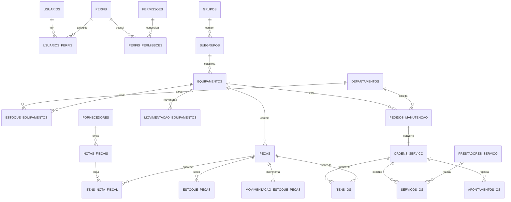

# Modelo de dados

20 tabelas, agrupadas em cinco blocos. Os tipos seguem o documento de arquitetura do projeto;
os nomes foram traduzidos para `snake_case` conforme a convenção do código.

## Diagrama entidade-relacionamento

## Blocos

### 1. Acesso
`usuarios`, `perfis`, `permissoes`, `usuarios_perfis` (N:N), `perfis_permissoes` (N:N).

A senha nunca é armazenada: só o hash, na coluna `senha_hash`. Perfis do diagrama de casos de
uso: **ADMINISTRADOR**, **GESTOR**, **TECNICO**, **CLIENTE**.

### 2. Catálogo
`departamentos`, `grupos`, `subgrupos`, `equipamentos`, `pecas`.

Hierarquia: Grupo → Subgrupo → Equipamento → Peça.

### 3. Compras
`fornecedores`, `prestadores_servico`, `notas_fiscais`, `itens_nota_fiscal`.

CNPJ guardado só com números (14 caracteres), `unique`, e validado pelos dígitos verificadores.

### 4. Estoque
`estoque_pecas`, `movimentacao_estoque_pecas`, `estoque_equipamentos`,
`movimentacao_equipamentos`.

`estoque_pecas.qtde_atual` é o saldo; `movimentacao_estoque_pecas` é o extrato. **Os dois
sempre têm que bater** — por isso toda alteração de saldo passa por `app/servicos/estoque.py`,
nunca direto na rota.

### 5. Manutenção
`pedidos_manutencao`, `ordens_servico`, `itens_os`, `servicos_os`, `apontamentos_os`.

`ordens_servico.id_pedido` é `unique` — é ela que garante a cardinalidade 1:1 no nível do
banco, mesmo se a aplicação falhar.

## Status usados no sistema

| Tabela | Coluna | Valores |
|---|---|---|
| `pedidos_manutencao` | `status` | ABERTO · APROVADO · REJEITADO · CONVERTIDO |
| `pedidos_manutencao` | `prioridade` | BAIXA · MEDIA · ALTA · CRITICA |
| `ordens_servico` | `status` | ABERTA · EM_EXECUCAO · AGUARDANDO_PECA · CONCLUIDA · CANCELADA |
| `movimentacao_estoque_pecas` | `tipo_movimento` | ENTRADA · SAIDA |
| `estoque_equipamentos` | `status` | ATIVO · EM_MANUTENCAO · BAIXADO |

As listas ficam como constantes no topo de cada model — nunca escreva a string solta no código.

## Regras de integridade que o código precisa garantir

1. Um pedido gera **no máximo uma** ordem de serviço (constraint `unique` + validação no serviço).
2. Saída de estoque **nunca** deixa o saldo negativo.
3. `estoque_pecas.qtde_atual` = soma algébrica das movimentações daquela peça.
4. `itens_os.valor_unitario` é **copiado** no momento do lançamento — mudar o preço da peça
   depois não pode alterar o custo histórico da OS.
5. OS concluída não aceita alteração (só ADMINISTRADOR reabre, com motivo registrado).
6. Fornecedor e prestador são desativados, nunca excluídos, para preservar o histórico.
